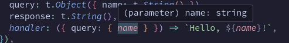
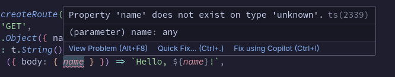
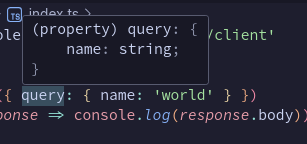
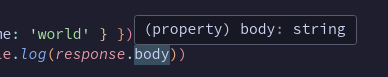

# 💤 Somnolence — The typed REST API framework of your dreams

Somnolence is a simple framework for providing strongly typed inputs and outputs to your REST API (soon in multiple languages!). The best part is that users of your API don't need access to your source code to generate a type safe client. They can just use Somnolence CLI to generate one, automatically!

Sometimes it's better to show than tell:

## TypeScript
### Install
```bash
# NPM
$ npm install @somnolence/node
$ npm install -g @somnolence/ts-cli

# PNPM
$ pnpm add @somnolence/node
$ pnpm add -g @somnolence/ts-cli

# Yarn
$ yarn add @somnolence/node
$ yarn global add @somnolence/ts-cli

# Bun runs on the much faster (2.5x) Bun HTTP server!
$ bun add @somnolence/bun
$ bun add -g @somnolence/ts-cli
```

### Usage
#### Create the server:
```typescript
import { createRoute, createSomnolenceServer, t } from '@somnolence/bun'

const somnolence = createSomnolenceServer({
  routes: {
    hello: createRoute({
      method: 'GET',
      query: t.Object({ name: t.String() }),
      response: t.String(),
      handler: ({ query: { name } }) => `Hello, ${name}!`,
    }),
  },
})

somnolence.start()
```

#### TypeScript automatically infers your handlers parameters!
_The "name" property in the handler automatically shows that it's a string:_<br />


_Incorrectly putting the "body" property throws up an error:_<br />


#### Start the server using whatever start script you want (e.g. `npm run start`)

#### Use the server and get out of the box schema validation:
```bash
curl http://localhost:3000/hello\?name\=Gabriel
# Hello, Gabriel!
curl http://localhost:3000/hello\?name\=1
# Expected string
curl http://localhost:3000/hello\?name\=false
# Expected string
curl http://localhost:3000/hello\?name\=comma,delimited,values,make,an,array
# Expected string
```

#### Generate the type-safe client:
```bash
# path/to/your/client
$ somnolence-ts --endpoint http://localhost:3000
# 💤 Generated Somnolence Client at node_modules/@somnolence/client
```

#### Use the type-safe client:
```typescript
import somnolence from '@somnolence/client'

somnolence
  .hello({ query: { name: 'world' } })
  .then(response => console.log(response.body)) // 'Hello, world!'
```

#### The client infers the inputs and outputs of each route:
_The client automatically knows what inputs are required_<br />


_The client automatically knows the response is a string_<br />


## Go
(Coming soon!)

## Python
(Coming later!)

## Rust
(Coming even later!)

## Java
(Coming never!)

## Others
Let me know what languages you'd like to see Somnolence implemented in. I'll likely be willing to take a crack at it!
