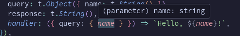
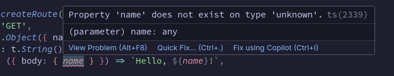

# 💤 Somnolence Node — The typed REST API framework of your dreams

Somnolence is a simple framework for providing strongly typed inputs and outputs to your REST API. The best part is that users of your API don't need access to your source code to generate a type safe client. They can just use Somnolence CLI to generate one, automatically!

Sometimes it's better to show than tell:

## Install
```bash
$ npm install @somnolence/node
```

## Usage
### Create the server:
```typescript
import { createRoute, createSomnolenceServer, t } from '@somnolence/node'

const somnolence = createSomnolenceServer({
  routes: {
    hello: {
      GET: createRoute({
        query: t.Object({ name: t.String() }),
        response: t.String(),
        handler: ({ query: { name } }) => `Hello, ${name}!`,
      })
    },
  },
})

somnolence.start()
```
### TypeScript automatically infers your handlers' parameters:
_The "name" property in the handler automatically shows that it's a string:_<br />


_Incorrectly putting the "body" property throws up an error:_<br />


### Start the server using whatever start script you want:
```bash
npm run start
```

### Use the server and get out of the box schema validation:
```bash
curl http://localhost:3000/hello\?name\=Gabriel
# Hello, Gabriel!
curl http://localhost:3000/hello\?name\=1
# Expected string
curl http://localhost:3000/hello\?name\=false
# Expected string
curl http://localhost:3000/hello\?name\=comma,delimited,values,make,an,array
# Expected string
```

### Utilize JSON bodies, too:
```typescript
const somnolence = createSomnolenceServer({
  routes: {
    hello: createRoute({
      method: 'POST',
      body: t.Object({ name: t.String() }),
      response: t.String(),
      handler: ({ body: { name } }) => `Hello, ${name}!`,
    }),
  },
})
```
```bash
curl -d '{"name":"Gabriel"}' -H "Content-Type: application/json" -X POST http://localhost:3000/hello
# Hello, Gabriel!
```

### Create route hierarchies:
```typescript
const somnolence = createSomnolenceServer({
  routes: {
    hello: {
      '/': createRoute({
        method: 'GET',
        query: t.Object({ name: t.String() }),
        response: t.String(),
        handler: ({ query: { name } }) => `Hello, ${name}!`,
      })
      world: createRoute({
        method: 'GET',
        response: t.String(),
        handler: ({ body: { name } }) => 'Hello, world!',
      })
    },
  },
})
```
```bash
curl http://localhost:3000/hello/world
# Hello, world!
```

### Get the raw JSON Schema:
```bash
curl http://localhost:3000/__schema
```
```json
{
  "hello": {
    "type": "object",
    "properties": {
      "path": { "const": "hello", "type": "string" },
      "method": { "const": "GET", "type": "string" },
      "query": {
        "type": "object",
        "properties": { "name": { "type": "string" } },
        "required": ["name"]
      },
      "response": { "type": "string" }
    },
    "required": ["path", "method", "query", "response"]
  }
}
```

### Auto-generate a type-safe client:
```bash
# path/to/your/client
$ npm install -g @somnolence/cli
$ somnolence-ts --endpoint http://localhost:3000
# 💤 Generated Somnolence Client at node_modules/@somnolence/client
```

### Use the type-safe client:
```typescript
import somnolence from '@somnolence/client'

somnolence
  .hello({ query: { name: 'world' } })
  .then(response => console.log(response.body)) // 'Hello, world!'
```

### The client infers the inputs and outputs of each route:
_The client automatically knows what inputs are required_<br />


_The client automatically knows the response is a string_<br />

