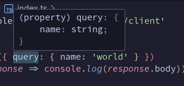

# 💤 Somnolence CLI — Generate type-safe clients from _any_ Somnolence Server and rest easy

Somnolence CLI generates type-safe clients from any server running Somnolence. You don't ened access to the server's source code to get its TypeScript types. Just point the CLI at any Somnolence Server and get one generated automatically!

## Install
```bash
# NPM
$ npm install -g @somnolence/ts-cli

# PNPM
$ pnpm add -g @somnolence/ts-cli

# Yarn
$ yarn global add @somnolence/ts-cli

# Bun
$ bun add -g @somnolence/ts-cli
```

## Usage
### Generate the client:
```bash
# path/to/your/client
$ somnolence-ts --endpoint https://my-cool-app.com/path/to/my-somnolence-server
# 💤 Generated Somnolence Client at node_modules/@somnolence/client
```

### Use the type-safe client:
```typescript
import somnolence from '@somnolence/client'

somnolence
  .hello({ query: { name: 'world' } })
  .then(response => console.log(response.body)) // 'Hello, world!'
```

### The client infers the inputs and outputs of each route:
_The client automatically knows what inputs are required_<br />


_The client automatically knows the response is a string_<br />


## CLI Options
```
$ somnolence-ts --help

  Usage
    $ somnolence-ts

  Options
    --endpoint  Endpoint for your Somnolence Server (default: http://localhost:3000)
    --outdir    Output directory for the generated, type-safe client (default: node_modules/@somnolence/client)

  Examples
    $ somnolence-ts --endpoint=https://backend.my-app.com
    💤 Generated Somnolence Client at node_modules/@somnolence/client
```
